<div align="center">

  

  <br />
  <br />

  # Desenvolvimento de Software, Web e Segurança

  <p>
    Desenvolvimento de interfaces modernas, responsivas e acessíveis.<br />
    Foco em qualidade de código, desempenho, design e experiência do usuário.
  </p>

  <a href="https://github.com/lucascodelab">
    
  </a>

  <br />

  
  
  

  <br />
  <br />

  
  <a href="https://github.com/lucascodelab?tab=followers">
    
  </a>

  <br />
  <br />

  <a href="https://github.com/lucascodelab?tab=repositories">
    
  </a>
  <a href="mailto:contato.lucascode@gmail.com">
    
  </a>

</div>

---

# Sobre mim

```typescript
const developer = {
    objetivo: "Criar experiências digitais modernas, rápidas e seguras",
    especialidades: [
        "Desenvolvimento Front-end",
        "JavaScript e TypeScript",
        "React, Next.js e Vue.js",
        "Interfaces responsivas"
    ],
    evoluir: () => ["estudar", "desenvolver", "testar", "compartilhar"]
};
```

- Desenvolvimento de interfaces web modernas e responsivas
- Aplicações front-end com TypeScript, React, Next.js e Vue.js
- Construção de interfaces responsivas com React, Next.js e Vue.js
- Interesse em criptografia, segurança e proteção de dados
- Aprendizado contínuo e colaboração em projetos de tecnologia

# Tecnologias

<div align="center">

  <sub>FRONT-END • INTERFACES • PERFORMANCE • SEGURANÇA</sub>

  <br />
  <br />

  

  <br />
  <br />

  

</div>

# Stack técnica

| Área | Tecnologias |
|:---|:---|
| Linguagens | JavaScript, TypeScript, HTML e CSS |
| Front-end | React, Next.js, Vue.js, Tailwind CSS, Sass e Vite |
| Desenvolvimento | Componentes, interfaces responsivas e aplicações web |
| Estilização | CSS, Tailwind CSS e Sass |
| Segurança | Criptografia, boas práticas e proteção de dados |
| Ferramentas | Git, GitHub, Vite, npm, pnpm, VS Code e Figma |

# Arquitetura da stack

<div align="center">

  

</div>

# Áreas de interesse

```text
Desenvolvimento Front-end
Design e qualidade de interfaces
Criptografia e segurança de aplicações
Performance, acessibilidade e experiência do usuário
Interfaces modernas e responsivas
Automação e boas práticas de desenvolvimento
```

# Princípios

> Código claro, arquitetura consistente, interfaces profissionais e segurança desde o início.

# Estatísticas do GitHub

<div align="center">

  

  <br />

  
  

</div>

# Sequência de contribuições

<div align="center">

  

</div>

# Mapa de contribuições

<div align="center">

  <picture>
    <source media="(prefers-color-scheme: dark)" srcset="https://raw.githubusercontent.com/lucascodelab/lucascodelab/output/github-contribution-grid-snake-dark.svg" />
    <source media="(prefers-color-scheme: light)" srcset="https://raw.githubusercontent.com/lucascodelab/lucascodelab/output/github-contribution-grid-snake.svg" />
    
  </picture>

</div>

# Atividade recente

<div align="center">

  

</div>

<div align="center">

  # Contato e colaboração

  <p>
    Explore meus repositórios para conhecer meus projetos e minha evolução profissional.<br />
    Estou disponível para colaborar em projetos, trocar conhecimento e desenvolver novas soluções.
  </p>

  <a href="https://www.linkedin.com/in/lucas--013b343a8/" target="_blank">
    
  </a>
  <a href="https://github.com/lucascodelab" target="_blank">
    
  </a>
  <a href="mailto:contato.lucascode@gmail.com">
    
  </a>

  <br />
  <br />

  <sub>Desenvolvido com foco em tecnologia, qualidade e evolução contínua.</sub>

  <br />
  <br />

  <sub>© 2026 Lucas. Todos os direitos reservados.</sub>

</div>


